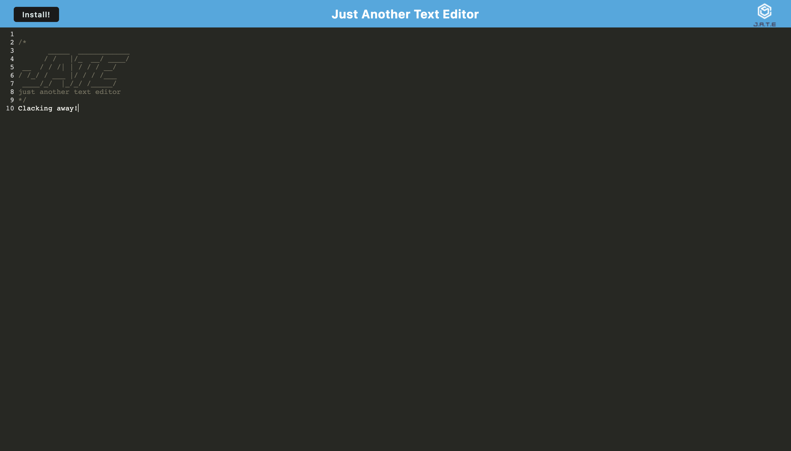

# Text Editor PWA

[](https://opensource.org/licenses/MIT)

## Description

This is a progressive web application built with webpack that allows users to write, save, and edit text. This text editor utilizes service workers to retrieve data cached with IndexedDB, and the application can be installed for use offline.



## Usage

You may host and use this application on your [local server](http://localhost:3001) after installing Node.js and MongoDB and running the following command from the command line:

```
npm i && npm start
```

Or you may visit the [deployed application](https://robot-power-vacuum.herokuapp.com/) hosted on Heroku.

You may install the app by with the "Install!" button in the top left.

### Questions

If you have any questions about this repository, open an issue or contact me directly at [pcragnol@gmail.com](mailto:pcragnol@gmail.com). You can find more of my work at [pcragnol](https://github.com/pcragnol/).

---
© 2022 Peter Cragnoline

Licensed under [MIT License](LICENSE)
